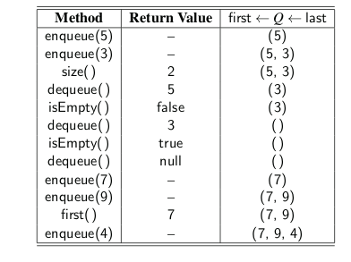

* TOC
{:toc}

## Midterm Sample Questions

* **Q1** What values are returned during the following series of stack operations, if exe-
cuted upon an initially empty stack?

**Solution**


* **Q2** What values are returned during the following sequence of queue operations, if
executed on an initially empty queue? 

**Solution**



* **Q3** Suppose an initially empty queue Q has performed a total of 32 enqueue operations, 10 first operations, 
and 15 dequeue operations, 5 of which returned null to indicate an empty queue. What is the current size of Q?

**Solution**

The current size of the Queue is **22**.

* **Q4** Suppose an initially empty stack S has performed a total of 25 push operations,
12 top operations, and 10 pop operations, 3 of which returned null to indicate an
empty stack. What is the current size of S?

**Solution**

The current size of the Stack is **18**.

* **Q5** Suppose Alice has picked three distinct integers and placed them into a stack S in
random order. Write a short, straightline piece of pseudocode (with no loops or
recursion) that uses only one comparison and only one variable x, yet that results
in variable x storing the largest of Alice’s three integers with probability 2/3.
Argue why your method is correct.

**Solution**

```java
x = S.pop()
if (x < S.top()){
    x = S.pop()
    if (x < S.top())
        x = S.pop()
}else{
    S.pop()
    if (x < S.top())
        x = S.pop()
}
x is the largest interger
```

```
let x equal to stack first elment
if x is less than top of stack
    then x is equal to pop of stack
        if x is less than top of stack
            then x is equal to pop of stack
else x is greate than top of stack
    drop (pop) the stack
    if x is less than top of stack
        then x is equal to pop of stack
```

* **Q6** Let A be an array of size n ≥ 2 containing integers from 1 to n − 1 inclusive, one
of which is repeated. Describe an algorithm for finding the integer in A that is
repeated.

**Solution**

```java
int x = A[0];
for (int i =1 ; i<A.length ;i++){
    if (x == A[i]){
        break; // found x
    }
    x = A[i]
}
```

* **Q7** Give an algorithm for finding the second-to-last node in a singly linked list in
which the last node is indicated by a null next reference.

**Solution**
```java
	public E secondToLast() {
		if (isEmpty() || size < 2 ) 
			return null;
        while (head.getNext.getNext != Null)
            head = head.getNext();
		return head;
	}
```

* **Q8** Calculate the Big(o) for the following code:

```java
public static int example5(int[ ] first, int[ ] second) { // assume equal-length arrays
    int n = first.length, count = 0; // T1 = a
    for (int i=0; i < n; i++) { // T2 = n * T3 = n * (T4 + T5 + T8) = b*n + c*n^3 + d * n
        int total = 0; // T4 = b
        for (int j=0; j < n; j++) // T5 = n * T6 = n * c * n == c * n^2
            for (int k=0; k <= j; k++) // T6 = n * T7 = c * n
                total += first[k]; // T7 = c
        if (second[i] == total) count++; // T8 = d
    }
    return count;
    //Big(o) = O(n^3)
}
```