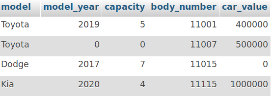
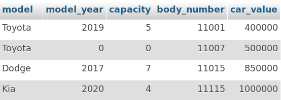
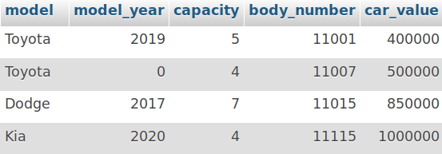

---
# You don't need to edit this file, it's empty on purpose.
# Edit theme's home layout instead if you wanna make some changes
# See: https://jekyllrb.com/docs/themes/#overriding-theme-defaults
layout: page
category: "notes"
course: "sbe306a"
year: "2019"
---
* TOC
{:toc}

# Lab 1

This week we will practice basic SQL statment tought in tutorial 1 & 2.

## Practice 1

You are requires to write any neccessary query needed to perform the operation without using PhpMyAdmin.

* Create the following table:


SQL query:

```
CREATE TABLE cars(
    model varchar(250),
    model_year int not null,
    capacity int not null,
    body_number int unique,
    car_value int not null
)
```

* provide SQL query to enter the following data




SQL query:
```
INSERT INTO cars (model,model_year,capacity,body_number,car_value) VALUES ("Toyota","2019","5","11001","400000");
INSERT INTO cars (model,body_number,car_value) VALUES ("Toyota","11007","500000");
INSERT INTO cars (model,model_year,capacity,body_number) VALUES ("Dodge","2017","7","11015");
INSERT INTO cars (model,model_year,capacity,body_number,car_value) VALUES ("Kia","2020","4","11115","1000000");
```

* provide SQL query to view the following data


SQL query:

```
select * from cars ORDER BY model;
```


SQL query:

```
select max(car_value) as max_car_price from cars
```


SQL query:

```
select model,model_year,car_value FROM cars where body_number = 11001;
```

* update the table to the following



SQL query:

```
UPDATE cars
SET car_value = 850000
WHERE body_number = 11015;
```



SQL query:

```
UPDATE cars
SET capacity = 4
WHERE body_number = 11007;
```


