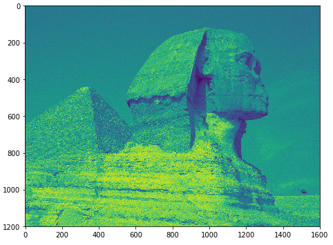
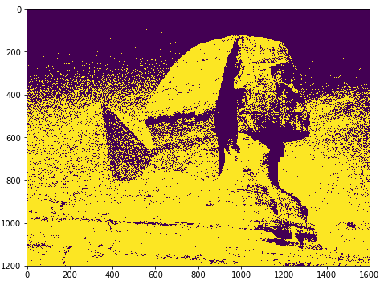
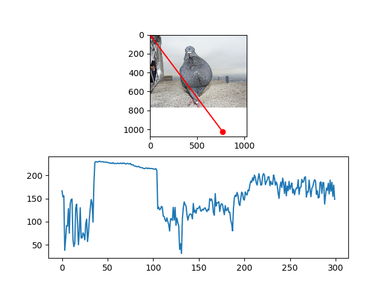

* TOC
{:toc}

## Images as Arrays


### RGB Images

For RGB images, each pixel is composed of three channels, namely: red, green, and blue.


### Binary Images and Scaler Images

* A pixel in a **binary** image is either 0 or 1.
* A pixel in a scaler image is composed of a single channel with scaler value.
  * Example: 256-grayscale images.

#### Converting from RGB to Grayscale

For each RGB pixel, we compute a combination of the three values into single value. In literature, using a combination of $$ \big[0.299, 0.587, 0.114\big] $$ is extensively used.

$$ I = \big[0.299, 0.587, 0.114\big] . \big[R, G, B\big]^T$$

```python
def rgb2gray(rgb_image):
    return np.dot(rgb_image[...,:3], [0.299, 0.587, 0.114])
```




#### Converting from Grayscale to Binary Image

We can binarize an image by using a *threshold* value, such that pixel value is 1 if $$ I > \text{threshold} $$ and 0 otherwise.


```python
def binarize( gray_image , threshold ):
    threshold = np.max( gray_image ) * threshold
    return 1 * ( gray_image > threshold )
```




## Mean and Variance

```python
print( np.mean( image ))

print( np.std( image ))
```

## Profiles

```python
x0 = 0
x1 = gray_image.shape[0] - 1
y0 = 0
y1 = gray_image.shape[1] - 1

x, y = np.linspace(x0, x1, 300), np.linspace(y0, y1, 300)
profile = gray_image[x.astype(np.int), y.astype(np.int)]

#-- Plot...
fig, axes = plt.subplots(nrows=2)
axes[0].imshow(gray_image)
axes[0].plot([x0, x1], [y0, y1], 'ro-')
axes[0].axis('image')

axes[1].plot(profile)

plt.show()
```




## Edges

In images, we are always interested to define the boundaries of objects existing in an image, and separating it from background. Edge detection is fundamental step in many Computer Vision pipelines.
The simplest form of edge detection is applying mathematical differentiation on image data. Since we work with digital pixels, we will apply difference equations.

### First-Order Derivatives

$$ \nabla f=\begin{bmatrix}
g_{x} \\
g_{y}
\end{bmatrix} = \begin{bmatrix}
\frac{\partial f}{\partial x} \\
\frac{\partial f}{\partial y}
\end{bmatrix} $$

where:

$$\textstyle\frac{\partial f}{\partial x}$$ is the derivative with respect to x (gradient in the x direction)

$$\textstyle\frac{\partial f}{\partial y}$$ is the derivative with respect to y (gradient in the y direction).


## Computer Vision Opportunities

### Internship at [Affectiva](https://www.affectiva.com)

<blockquote class="twitter-tweet" data-lang="en"><p lang="en" dir="ltr">📢⁉️ Calling all interns! Looking for a <a href="https://twitter.com/hashtag/Boston?src=hash&amp;ref_src=twsrc%5Etfw">#Boston</a> –based <a href="https://twitter.com/hashtag/engineering?src=hash&amp;ref_src=twsrc%5Etfw">#engineering</a> <a href="https://twitter.com/hashtag/internship?src=hash&amp;ref_src=twsrc%5Etfw">#internship</a>? We are offering exciting opportunities in 2019, see all our openings here!  <a href="https://t.co/iMdBXzMcfz">https://t.co/iMdBXzMcfz</a></p>&mdash; Rana el Kaliouby (@kaliouby) <a href="https://twitter.com/kaliouby/status/1088185353180274696?ref_src=twsrc%5Etfw">January 23, 2019</a></blockquote>
<script async src="https://platform.twitter.com/widgets.js" charset="utf-8"></script>

A very interesting talk by *Rana Elkaliouby* about Affectiva:

<div style="max-width:854px"><div style="position:relative;height:0;padding-bottom:56.25%"><iframe src="https://embed.ted.com/talks/lang/ar/rana_el_kaliouby_this_app_knows_how_you_feel_from_the_look_on_your_face" width="854" height="480" style="position:absolute;left:0;top:0;width:100%;height:100%" frameborder="0" scrolling="no" allowfullscreen></iframe></div></div>

### 360imaging in Egypt


An intuitive and easy to use treatment planning software for accurate and predictable planning of implant cases.

[Website](http://www.360imaging.com/)

* Planned Dental Surgeries.
* They demand highly skilled C++ developers.
* Computer Vision background is a plus
* They offer opportunities through Wuzzuf.

## Resources

* [Awsome Computer Vision](https://github.com/jbhuang0604/awesome-computer-vision), **+5K** starts.
* [Awesome Machine Learning](https://github.com/josephmisiti/awesome-machine-learning), **30K** starts.
* [Stanford Machine Learning Group](https://stanfordmlgroup.github.io/)

## Week 1: Demo and Lab Source Files

```bash
$ git clone https://github.com/sbme-tutorials/sbe401-week2-demo.git
```