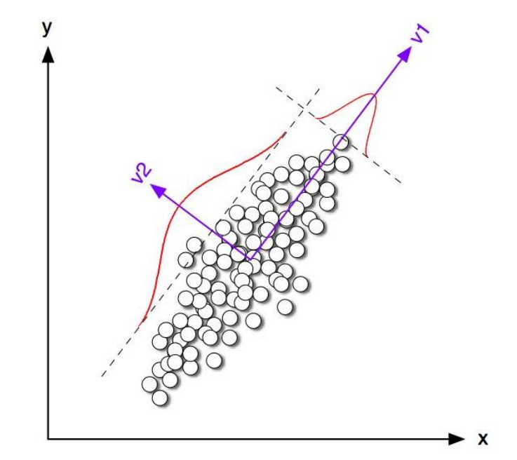
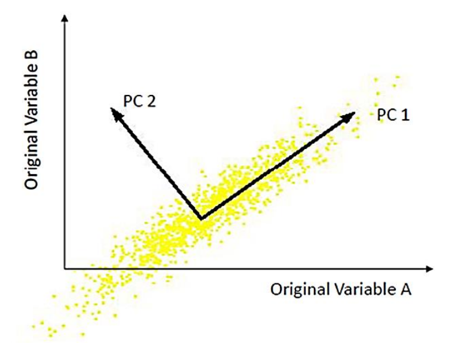
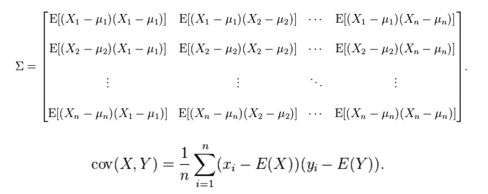
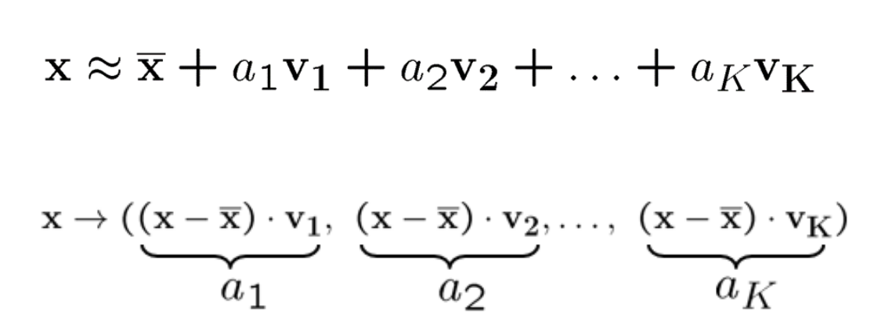
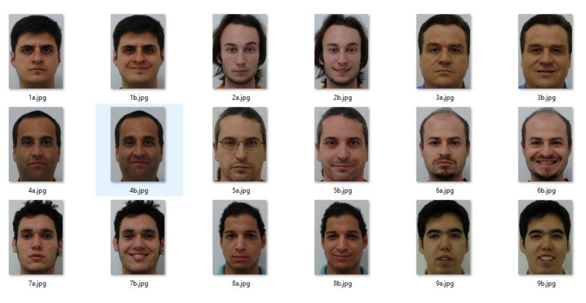

* TOC
{:toc}

##  Principle component analysis(PCA)

A statistical procedure that uses an orthogonal transformation to convert a set of observations of possibly correlated variables (entities each of which takes on various numerical values) into a set of values of linearly uncorrelated variables called principal components.

  

### You may need to revise these points :

*  Standard deviation
* Covariance Matrix
* Eigenvalues , Eigenvectors
* Singular value decomposition

### Advantages: 

* Reduction of dimensions
* Show the trend of the data
* The new dimensions are linear combination of the original dimensions
* Capture as much variance of the data as possible

  

### PCA steps

1. Get some data in shape of **no of samples x no of dimensions(features)**.

2. adjust the new data by subtracting the mean from al samples.

3. Calculate the covariance matrix whose shape is ( no of features x no of features).

4. Calculate the eigenvectors and eigenvalues of the covariance matrix

5. Then normalize the eigen vectors to unit vectors 

6. project your data to new dimensions (eigenvectors).

**Daa projection is done by multiplying raw data with eigen space which is a matrix composed of all eigenvectors together so in case of dimensionality reduction we just remove the last eigenvectors with least eigenvalues**

**An eigenvalue is a number, telling you how much variance there is in the data in that direction**

### Covariance matrix 

* A covariance refers to the measure of how two random variables will change together and is used to calculate the correlation between
variables.
* The variance refers to the spread of the data set — how far apart the numbers are in relation to the mean

  

### Transfer to the New coordinate System

Previously we said the new vectors is a linear combination f old features so to transfer data(adjust) use the following equation:

  

##  Face recognition with eigen faces

  

* reshape the whole images to 1D vectors
* construct data matrix in shape of (no of images x no of pixels)
* Get the Mean Image
* Subtract the mean image from All images.
* Get the Covariance matrix
* Error Two much Data
* Use the Singular Value decomposition to get eigen vectors and eigen values
* The singular value is semi-equal to the sqrt of the Eigenvalue
* normalize the eigen vectors
* keep all vectors summing up eigen values to 90% and remove the rest
* then map all images to new components and it will be in shape (no of images * no of remaining eigen vectors)

  

Above described is the training process where now er have w eigen space(matrix of remaining eigen vectors) and adjust it data. Now to start recognize face just take a test image and do the previous procedure so you get the new image vector in terms of eign space either using classifier or matching you can recognize the mage class or owner.

